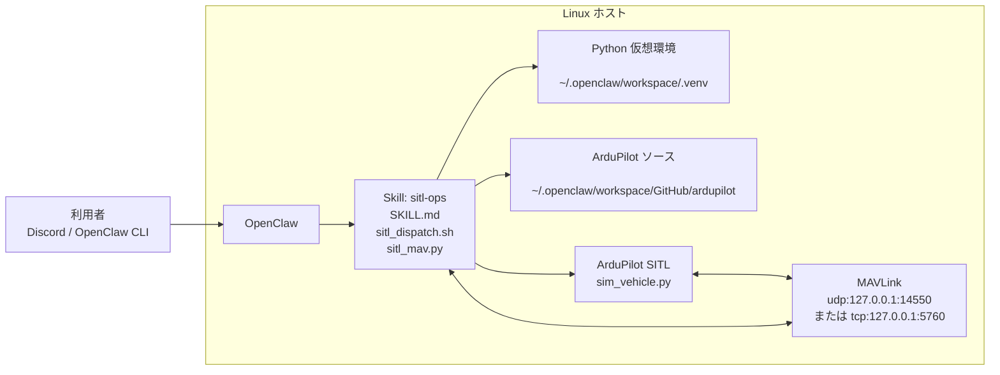
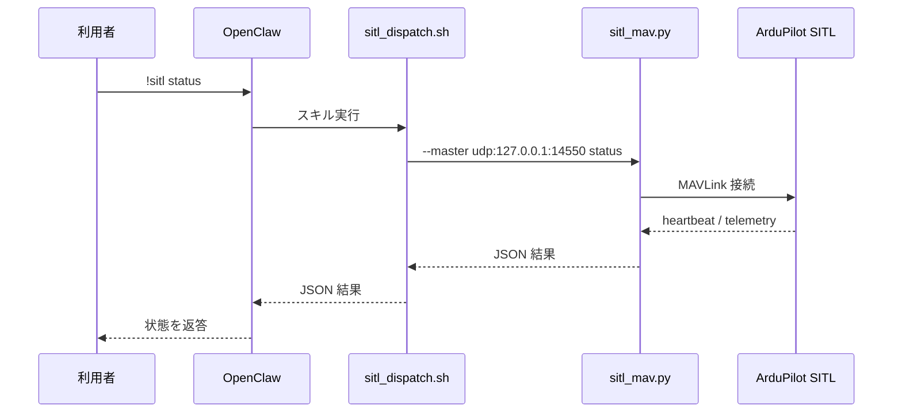

# 想定構成図

このドキュメントは、この Skill が想定している実行構成を図で示したものです。

結論:
- ArduPilot SITL は Linux 上で単独起動する前提です
- Windows 版 Mission Planner 内蔵の SITL は想定していません
- OpenClaw と SITL は同一ホスト上で動作する想定です

## 1. 全体構成



## 2. 役割ごとの説明

### 利用者

利用者は OpenClaw に対して、たとえば次のようなコマンドを要求します。

```text
!sitl start
!sitl status
!sitl arm
!sitl takeoff 10
```

### OpenClaw

OpenClaw は Skill を呼び出し、[SKILL.md](../SKILL.md) に従って dispatcher を実行します。

### Skill: sitl-ops

Skill の中心は次の 2 ファイルです。

- [scripts/sitl_dispatch.sh](../scripts/sitl_dispatch.sh)
- [scripts/sitl_mav.py](../scripts/sitl_mav.py)

役割:
- `sitl_dispatch.sh`: `!sitl ...` 形式のコマンド解釈、SITL 起動停止、MAVLink 接続先の解決
- `sitl_mav.py`: MAVLink で status、arm、takeoff、mode、param get/set を実行

### Python 仮想環境

Skill 側の Python 依存関係は、OpenClaw workspace 直下の `.venv` を使う想定です。

主な依存関係:
- `pymavlink`
- `empy==3.3.4`
- `MAVProxy`

構築スクリプト:
- [scripts/setup_venv.sh](../scripts/setup_venv.sh)

### ArduPilot ソース

SITL は ArduPilot リポジトリ内の `sim_vehicle.py` を使って起動します。

想定パス:

```text
~/.openclaw/workspace/GitHub/ardupilot
```

### ArduPilot SITL

SITL は Linux ホスト上で動作する独立プロセスです。

起動例:

```bash
./Tools/autotest/sim_vehicle.py -v Copter -L Kawachi --no-mavproxy
```

つまり、この Skill の前提は次の通りです。

- OpenClaw が Linux ホスト上で動いている
- 同じ Linux ホスト上に ArduPilot ソースがある
- そのホスト上で SITL を起動する

## 3. 通信の流れ

コマンド実行時の流れは次の通りです。



## 4. ディレクトリ構成イメージ

```text
~/.openclaw/workspace/
├─ skills/
│  └─ sitl-ops/
│     ├─ SKILL.md
│     ├─ docs/
│     │  ├─ 10_導入手順.md
│     │  └─ 11_想定構成図.md
│     └─ scripts/
│        ├─ setup_venv.sh
│        ├─ sitl_dispatch.sh
│        └─ sitl_mav.py
├─ .venv/
└─ GitHub/
   └─ ardupilot/
      └─ Tools/
         └─ autotest/
            └─ sim_vehicle.py
```

## 5. 想定していない構成

この Skill がそのままでは想定していない構成は次の通りです。

### Windows 版 Mission Planner 内蔵 SITL

非想定の理由:
- [scripts/sitl_dispatch.sh](../scripts/sitl_dispatch.sh) は bash 前提です
- `source`、`nohup`、`/tmp`、`/home/...` など Linux 向けの記述があります
- SITL 起動方法が Mission Planner ではなく `sim_vehicle.py` です

### OpenClaw と SITL が別ホスト

非想定ではありませんが、既定値のままでは動きません。

既定の接続先は localhost です。

```text
udp:127.0.0.1:14550
```

別ホストにする場合は、`SITL_MASTER` を明示的に設定する必要があります。

## 6. まとめ

この Skill の想定構成は次の 1 行で表せます。

Linux ホスト上で OpenClaw と ArduPilot SITL を動かし、同一ホスト内の MAVLink 接続で制御する構成です。