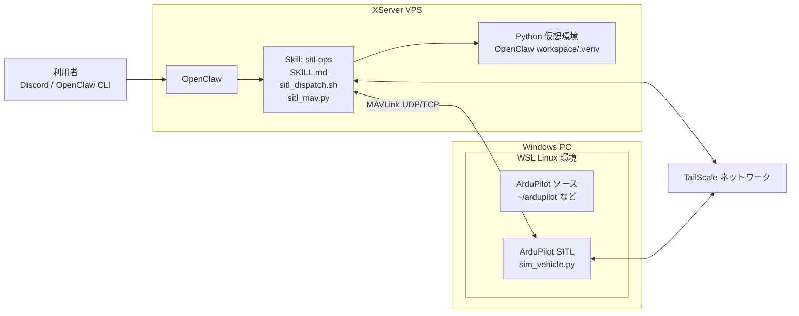
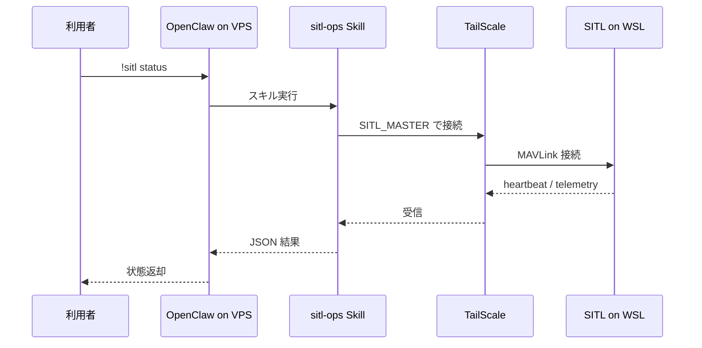

# 分離構成図: XServer VPS OpenClaw + WSL SITL

このドキュメントは、次の構成でこの Skill を使う場合の想定構成図です。

前提:
- OpenClaw は XServer の VPS 上で動かす
- XServer VPS には TailScale を導入済み
- ArduPilot SITL は Windows PC の WSL 上で動かす
- Windows PC 側にも TailScale を導入済み

結論:
- `status`、`arm`、`takeoff`、`mode`、`param get/set` は、OpenClaw から WSL 上の SITL へリモート接続して実行可能です
- `!sitl start` と `!sitl stop` も、SSH で WSL 側に入れる構成ならリモート実行可能です
- `SITL_MASTER` などは設定ファイルで固定化できるため、毎回 `export` しなくて構いません

## 1. 全体構成



## 2. ホストごとの役割

### XServer VPS 側

XServer VPS 側で動くもの:
- OpenClaw
- sitl-ops Skill
- Skill 用 Python 仮想環境

役割:
- 利用者からの `!sitl ...` 要求を受ける
- `sitl_mav.py` で WSL 上の SITL に MAVLink 接続する
- 結果を JSON で返す

### Windows PC / WSL 側

WSL 側で動くもの:
- ArduPilot リポジトリ
- `sim_vehicle.py`
- ArduPilot SITL 本体

役割:
- 実際の機体シミュレーションを実行する
- TailScale 到達可能なアドレスで MAVLink を待ち受ける

## 3. 通信の流れ



## 4. 重要な設定ポイント

### `SITL_MASTER` は localhost ではなく WSL 側を指す

同一ホスト前提の既定値は次です。

```text
udp:127.0.0.1:14550
```

分離構成では、OpenClaw 側から見える WSL 側の TailScale アドレスを使います。

例:

```text
udp:100.x.y.z:14550
```

または:

```text
tcp:100.x.y.z:5760
```

### `!sitl start` と `!sitl stop` は SSH 前提で使う

理由:
- 現在の [scripts/sitl_dispatch.sh](../scripts/sitl_dispatch.sh) は、`SITL_REMOTE_SSH_TARGET` が設定されていれば SSH 経由でリモート実行します
- SSH 接続先は、WSL に直接入れる構成、または Windows 側 OpenSSH から WSL へ転送する構成のどちらでも構いません

そのため、この構成では次の運用が必要です。

1. OpenClaw 側で `sitl-ops.remote.env.example` を元に `.sitl-ops.env` を作る
2. `!sitl start` で WSL 上の SITL を SSH 起動する
3. `status`、`arm`、`takeoff` などを OpenClaw から実行する

## 5. ディレクトリ構成イメージ

### XServer VPS 側

```text
~/.openclaw/workspace/
├─ skills/
│  └─ sitl-ops/
│     ├─ SKILL.md
│     ├─ docs/
│     │  ├─ 10_導入手順.md
│     │  ├─ 11_想定構成図.md
│     │  ├─ 12_分離構成図_XServerVPS_OpenClaw_WSL_SITL.md
│     │  └─ 13_導入手順_XServerVPS_OpenClaw_WSL_SITL.md
│     └─ scripts/
│        ├─ setup_venv.sh
│        ├─ sitl_dispatch.sh
│        └─ sitl_mav.py
└─ .venv/
```

### Windows PC の WSL 側

```text
~/ardupilot/
└─ Tools/
   └─ autotest/
      └─ sim_vehicle.py
```

## 6. まとめ

この分離構成は、MAVLink の接続先を TailScale 経由の WSL 側アドレスへ切り替え、必要なら SSH 経由で WSL 側の起動停止も委譲することで成立します。

`sitl-ops.remote.env.example` を元に `.sitl-ops.env` を作って接続先を固定しておけば、毎回の `export` も不要です。